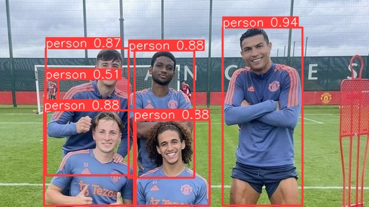
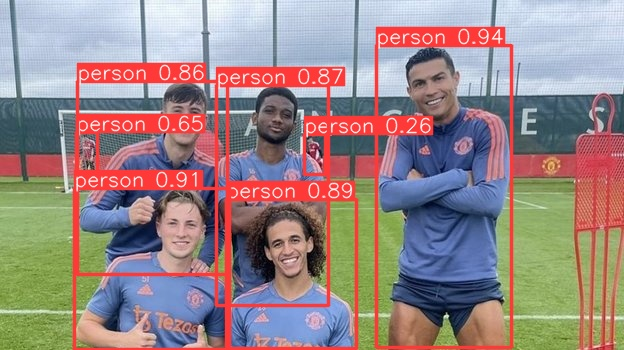
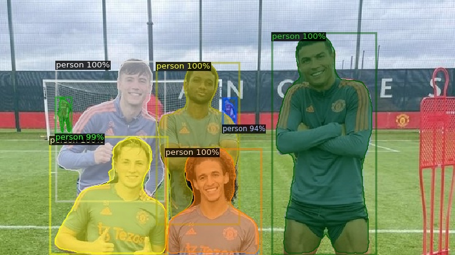

# NN_tests
# тестим разные модели

Для того, чтобы все работало нужен python3)))

возможно еще понадобиться python3-dev

я так качал
```bash
sudo apt-get install python3-dev
```

без него него не хотел запускаться detectron2

Создание и запуск виртуального окружения

```bash
python3 -m venv .venv
source ./.venv/bin/activate
pip install -r requirements_pre.txt
pip install -r requirements.txt
```

> скачается половина интернета, но это нормально


> два файла зависимостей, ибо я не смог пофиксить ошибку, связанную со строчкой 

> -e git+https://github.com/facebookresearch/detectron2.git@b7c7f4ba82192ff06f2bbb162b9f67b00ea55867#egg=detectron2

> при ее выполнении требуются уже установленные либы, но их нет при первом запуске pip install ..., поэтому я сделал 2 файла : в первом только либы, во втором (который по канону) - все либы + эта фигня


> на моменте Running setup.py... может зависнуть, но все ок, так должно быть, он думает....

чтобы выйти из виртуального окружения надо просто прописать в консоль 

```bash
deactivate
```

При изменении requirements.txt (если качаете новые библиотеки или меняете версии старых)

```bash
pip3 freeze > requirements.txt
```


## отчеты 

### YOLO

#### тест 0

Сам тест прописан в файле [test0.py](./YOLO8/test0.py)

Просто тестим, что модель хотя бы запускается, как она работает 

При выполнениии строчки 
```python3
model = YOLO("yolov8n.pt")
```
файл 'yolov8n.pt' сам подгружается с гитхаба, поэтому я не буду далее хранить файлы *.pt в проекте, чтобы не засорять его (тут и так будет дофига файлов - результатов тестов и тд.)

Нулевой тест использует файл [people.jpg](./YOLO8/people.jpg) и сохраняет результат в ./runs/detect/predict/people.jpg




**Вывод: Вроде работает. В дальнейшем надо бы создать отдельную дерикторию для тестовых файлов!!!**


#### тест 1

[test1.py](./YOLO8/test1.py)

Тестим 3 модели на примере той же картинке из нулевого теста

1 - yolov8n

2 - yolov8s

3 - yolov8m

результаты сохраняются соответственно в

result_1


result_2



result_3


вывод в консоль

```bash

0: 384x640 6 persons, 63.6ms
Speed: 2.0ms preprocess, 63.6ms inference, 524.9ms postprocess per image at shape (1, 3, 384, 640)
Results saved to /home/roman/NN_tests/runs/detect/predict2

0: 384x640 7 persons, 110.4ms
Speed: 1.2ms preprocess, 110.4ms inference, 1.0ms postprocess per image at shape (1, 3, 384, 640)
Results saved to /home/roman/NN_tests/runs/detect/predict3

0: 384x640 6 persons, 178.7ms
Speed: 1.2ms preprocess, 178.7ms inference, 0.7ms postprocess per image at shape (1, 3, 384, 640)
Results saved to /home/roman/NN_tests/runs/detect/predict4
```

видим, что наномодель (yolov8n) дольше всех продобратавыет изображение, но быстрее всех делает вывод (inference), причем значительно быстрее остальных

Также методом пристального взгляда можно обнаружить, что yolov8n меньше всех уверена в своем результате, а челика справа от ворот смогла обнаружить только yolov8s 


**Вывод: В общем и целом нужно больше тестов на разных фото и видео в бОльшем количестве, также напоминаю про вывод из нулевого теста!!!
Еще нужно разобраться как сохранять результаты в кастомную дерикторию, и как посмотреть вычислительные затраты модели???**


### detectron2

это нейронка от  facebookresearch 

#### тест 0 

Ну тут просто убеждаемся, что все работает

result.jpg 



**Вывод: Находит всех людей и супер уверена в своем результате, но что по времени и вычислительным затратам... надо тестить на эмуляторе все и на видосах. А еще разобраться надо как обучать все модели**


### Список литературы

https://docs.ultralytics.com/usage/python/

https://github.com/ultralytics/ultralytics/tree/main/ultralytics/models

https://github.com/rbgirshick/fast-rcnn

https://github.com/facebookresearch/detectron2/blob/main/INSTALL.md

https://detectron2.readthedocs.io/en/latest/tutorials/getting_started.html

https://colab.research.google.com/drive/16jcaJoc6bCFAQ96jDe2HwtXj7BMD_-m5

https://github.com/facebookresearch/detectron2/issues/374